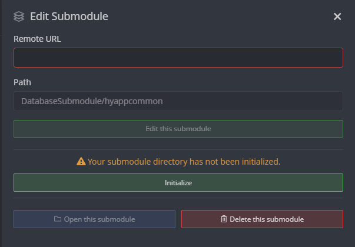

# How to work with submodules in git ?

## With GitKraken

### How to fix "Your submodule directory has not been initialized" ?

* Open the git terminal
* Go to the folder of the submodule
* Execute `git reset --hard`
* restart GitKraken